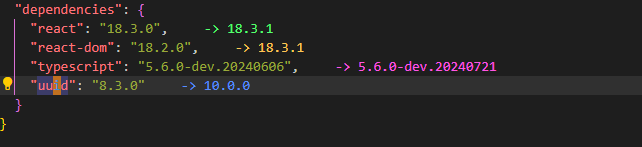
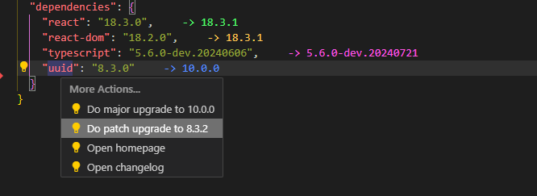

# package-json-upgrade

Shows available updates in package.json. Offers quick actions to guide you in your updating.

## Preview

The available updates are shown as color coded decoration to the right of each line.

The extension adds code actions that are available through the quick fix-command. Default keyboard shortcut is "ctrl + ."

These quick actions can update the dependency, but also links to the homepage and, if found, the changelog.

## Reason to exist

There exists good alternatives to this extension:

[Version Lens](https://github.com/vscode-contrib/vscode-versionlens)

[Better package json](https://github.com/ldd/better-package-json)

I didnt like that Version Lens interface and missed quick access to the changelog. But Version Lens was the only extension that made it simple to update specific dependencies. This extension aims to solve these issues.

## Extension Settings

A config is available to control if the updates should always be shown when a package.json is opened, or if they should only be shown after triggering a command called "Toggle showing package.json available updates". This can be useful if you find that this extension is in the way when you are doing other work in your package.json file.

## Install

[How to install vscode extensions](https://code.visualstudio.com/docs/editor/extension-gallery)
